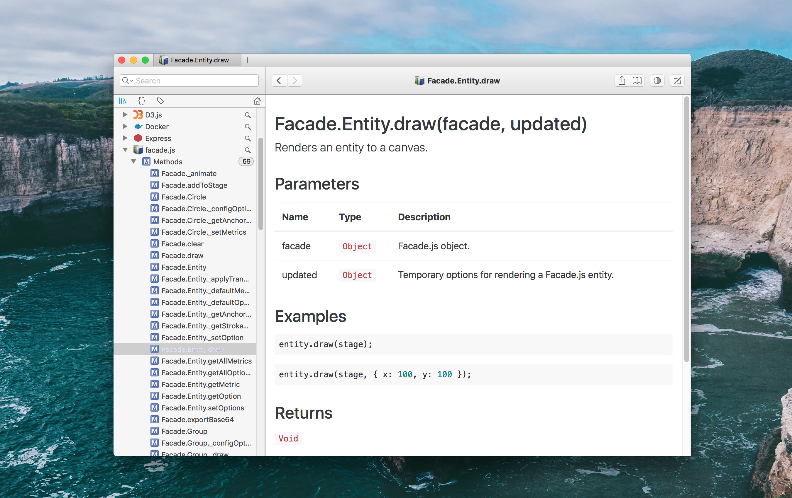

# doxdox-plugin-dash

[](https://greenkeeper.io/)

> Dash export plugin for doxdox.

[](https://travis-ci.org/neogeek/doxdox-plugin-dash)
[](https://www.npmjs.org/package/doxdox-plugin-dash)
[](https://doxdox.org/neogeek/doxdox-plugin-dash)

## Install

```bash
$ npm install doxdox doxdox-plugin-dash --save-dev
```

## Usage

```bash
$ doxdox 'src/**/*.js' --layout dash --output docs.zip
```

## Screenshot


